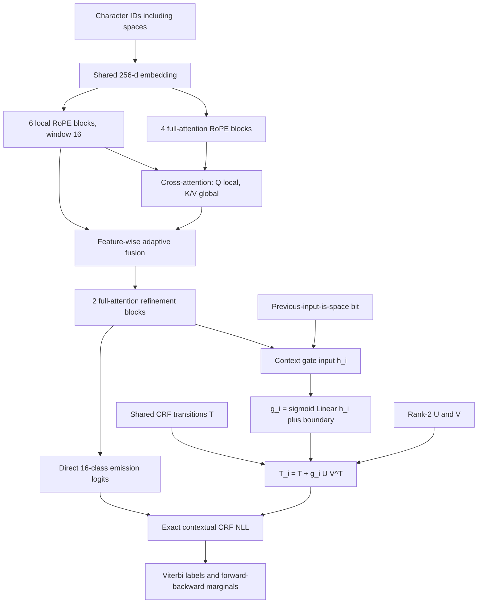

# DziriFormer-DualRoPE-ContextLowRankBoundaryCRF-v11

## Experiment status

Implementation complete; seed-42 full training has not been run yet.

This is a controlled Track 4 experiment. It keeps the complete
DualRoPE-CRF-v7 encoder, direct 16-class emissions, training data, optimizer,
batch size, OneCycle schedule, epoch budget, and seed. Only the CRF transition
parameterization changes.

## Motivation

Three controlled results point in different but compatible directions:

| Decoder | Neural correct | Main finding |
|---|---:|---|
| CRF-v7 | 14,816 | A shared transition matrix gained 52 letters over CE. |
| BoundaryCRF-v8 | 14,837 | Full boundary-specific transitions gained another 21. |
| LowRankBoundaryCRF-v10 | 14,800 | Total accuracy fell, but OOV correct gained 7 and exact words gained 3. |

The full BoundaryCRF forces one separate 16-by-16 matrix at every word entry.
The static rank-2 experiment forces the same low-rank correction at every word
entry. V11 instead learns how strongly the residual applies at every scored
transition from the current contextual state and an explicit boundary bit.

## Architecture



For the transition into scored letter `i`:

```text
b_i = 1 if the previous input character is a space, otherwise 0
g_i = sigmoid(W_g [h_i ; b_i] + c_g)
R   = U V^T, U in R^(16x2), V in R^(2x16)
T_i = T_shared + g_i R
```

The gate is feature-conditioned, not a manually chosen interpolation weight.
Because `h_i` contains local, global, and refinement context, two identical
word boundaries can receive different transition strengths.

## Initialization and gradient behavior

- `T_shared`, CRF start, and CRF end vectors use the ordinary CRF-v7
  initialization.
- `U` is initialized from `N(0, 0.02)`.
- `V` is initialized to zero, making `UV^T` exactly zero.
- gate weight and bias are initialized to zero, so every active gate begins at
  `0.5`.

Therefore the initial effective transition matrix is exactly `T_shared`.
`U` and `V` are not both zero because that would create a dead bilinear
factorization with zero gradient. The first update reaches `V`; after the
residual becomes nonzero, gradients also reach `U` and the contextual gate.

## Controlled configuration

```text
Model:          9,890,418 parameters
Added to v7:    322 parameters
  rank-2 U,V:    64
  gate Linear:  258
Seed:           42
Epochs:         25
Batch size:     64
Optimizer:      AdamW
Learning rate:  3e-4
Weight decay:   0.01
Scheduler:      OneCycleLR
Gradient clip:  1.0
Device:         MPS
```

Configuration:

```text
configs/track4/Lyes/context_boundary_v11/model.json
```

## Train seed 42

From the repository root with the virtual environment active:

```bash
python -m training.track4.Lyes.train \
  --config configs/track4/Lyes/context_boundary_v11/model.json \
  --num-workers 0
```

Expected training directory:

```text
outputs/context_boundary_v11/01_seed42/
  best.pt
  last.pt
  metrics.jsonl
  resolved_config.json
  summary.json
```

The completed `summary.json` must report `"device": "mps"`.

## Evaluate, measure, and export

After `best.pt` exists:

```bash
python -m experiments.track4.Lyes.context_boundary_v11 \
  --config configs/track4/Lyes/context_boundary_v11/evaluation.json \
  --device mps \
  --batch-size 128 \
  --num-workers 0
```

This command:

1. evaluates neural Viterbi predictions on released dev;
2. applies unchanged V2 to CRF marginals and Viterbi labels;
3. calculates the complete paper metric set;
4. reports overall, boundary, and within-word context-gate statistics;
5. evaluates the predeclared acceptance gates;
6. generates neural and V2 test submissions;
7. verifies both CSVs byte-for-byte with the official converter.

Expected output:

```text
outputs/context_boundary_v11/02_evaluation/
  SELECTION.json
  MANIFEST.json
  diagnostics.json
  neural_paper_metrics.json
  v2_paper_metrics.json
  artifacts/
    DZIRIFORMER_DUALROPE_CONTEXT_LOWRANK_BOUNDARY_CRF_V11_SEED42_NEURAL_SUBMISSION.csv
    DZIRIFORMER_DUALROPE_CONTEXT_LOWRANK_BOUNDARY_CRF_V11_SEED42_NEURAL_TEST_VOCALIZED.txt
    DZIRIFORMER_DUALROPE_CONTEXT_LOWRANK_BOUNDARY_CRF_V11_SEED42_NEURAL_OFFICIAL_CHECK.csv
    DZIRIFORMER_DUALROPE_CONTEXT_LOWRANK_BOUNDARY_CRF_V11_SEED42_V2_SUBMISSION.csv
    DZIRIFORMER_DUALROPE_CONTEXT_LOWRANK_BOUNDARY_CRF_V11_SEED42_V2_TEST_VOCALIZED.txt
    DZIRIFORMER_DUALROPE_CONTEXT_LOWRANK_BOUNDARY_CRF_V11_SEED42_V2_OFFICIAL_CHECK.csv
```

## Predeclared acceptance gates

The architecture is accepted only if every neural condition passes:

| Measure | Gate |
|---|---:|
| Correct letters | at least 14,831 |
| OOV correct letters | greater than 2,745 |
| Exact words | greater than 3,039 |
| Shadda accuracy | at least 0.9822043782 |
| Tanween accuracy | at least 0.9997741901 |

The V2 artifact is recommended for Kaggle only if the architecture passes all
neural gates and V2 exceeds 14,977 correct dev letters. `SELECTION.json` is the
authoritative decision. The presence of a CSV alone is not permission to
submit it.

Seeds 43/44 remain deferred until seed 42 passes, matching the current compute
policy.

## Kaggle descriptions

Neural ablation:

> DziriFormer-DualRoPE-ContextLowRankBoundaryCRF-v11 neural ablation. Track 4
> from-scratch parallel local/global RoPE character Transformer with direct
> 16-class emissions. A learned context-and-boundary gate scales a rank-2 CRF
> transition residual independently at each scored letter. No pretrained
> model, external data, or lexical fallback.

V2 candidate:

> DziriFormer-DualRoPE-ContextLowRankBoundaryCRF-v11 + V2. The from-scratch
> DualRoPE encoder uses a learned context-and-boundary gate to scale a rank-2
> CRF transition residual at each scored letter. The unchanged training-only
> confidence-gated V2 lexical fallback is applied to CRF marginals and Viterbi
> labels. Submit only if `SELECTION.json` marks `competitive_submission=true`.

## Tests

```bash
python -m pytest -q tests/test_context_boundary_v11.py
```

The golden tests cover exact partition, gold score, Viterbi decoding,
forward-backward marginals, zero-residual equivalence to CRF-v7, live
gradients, boundary-bit construction, parameter count, strict configuration,
and old-checkpoint compatibility.
